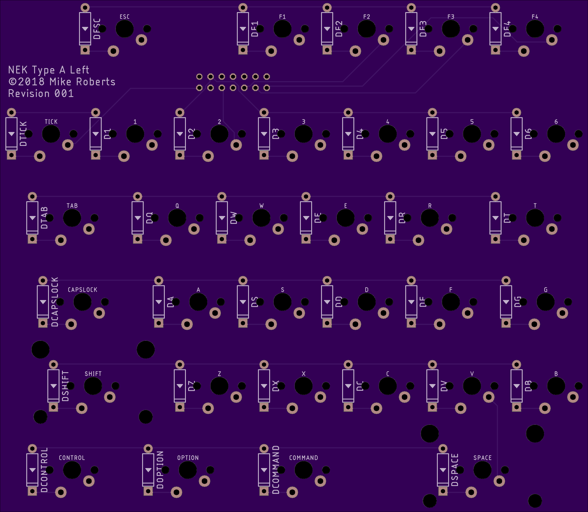
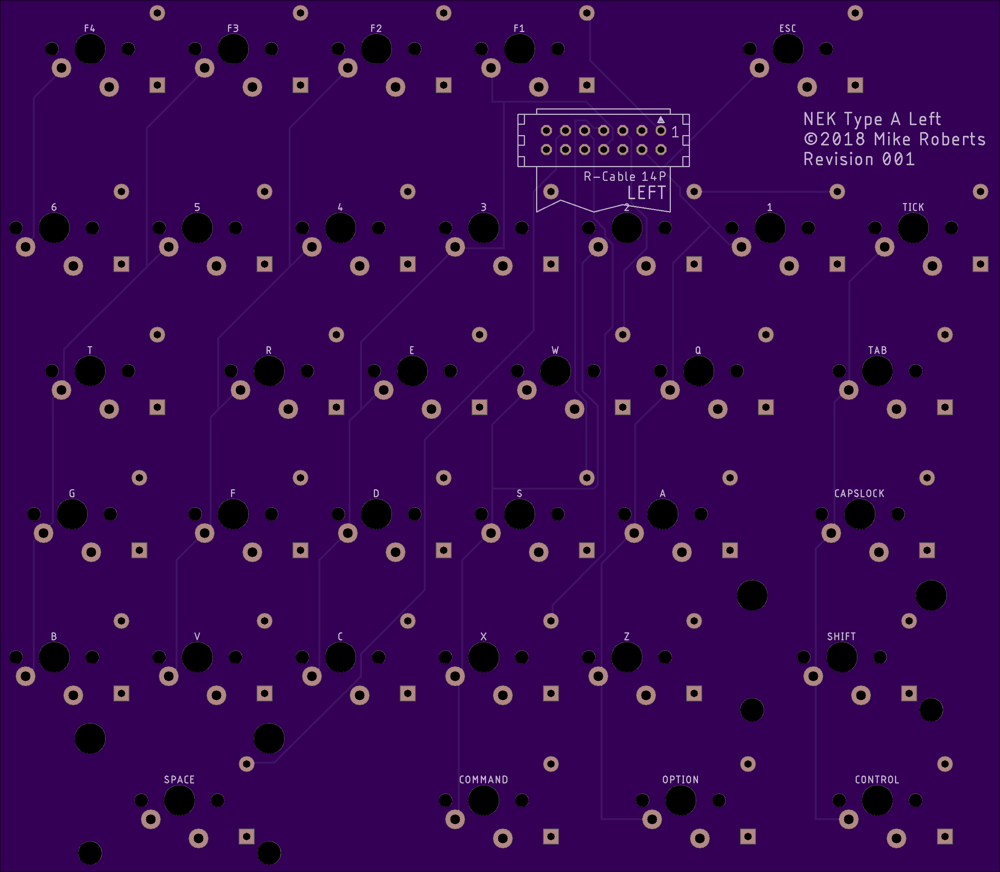
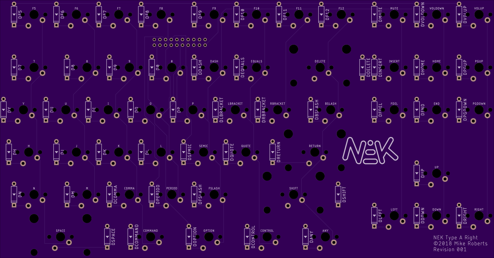
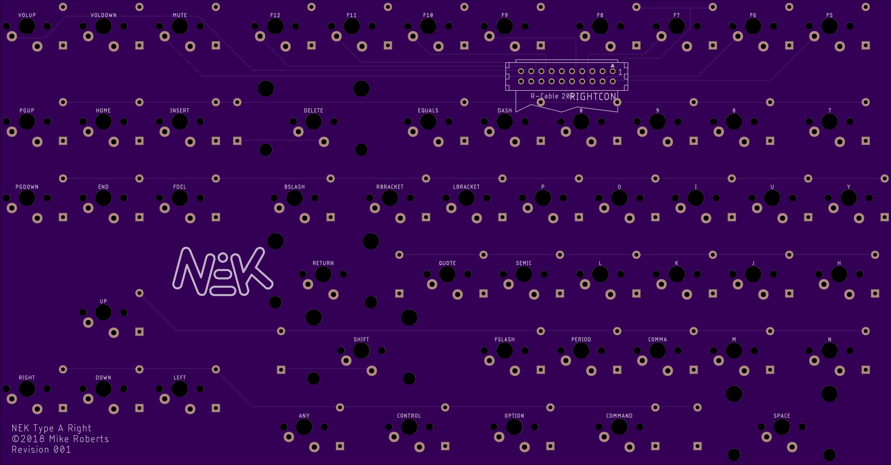
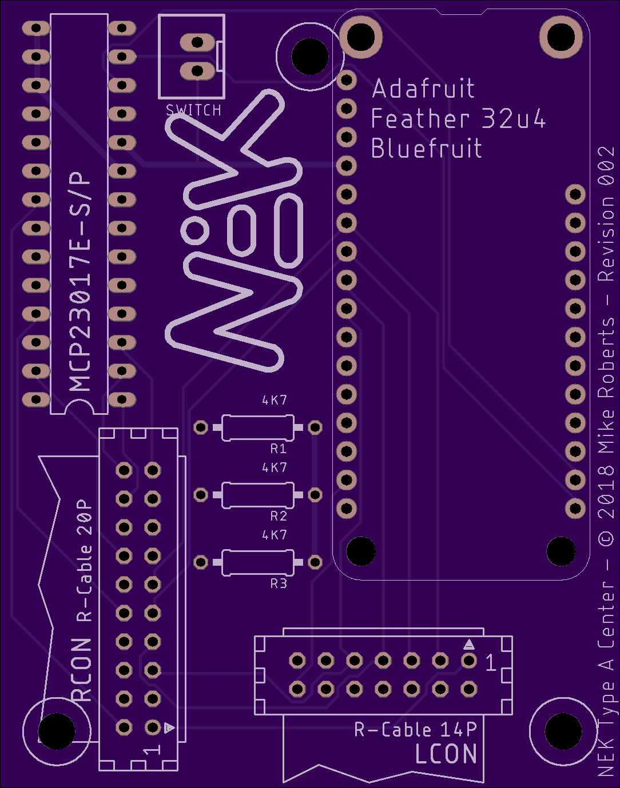
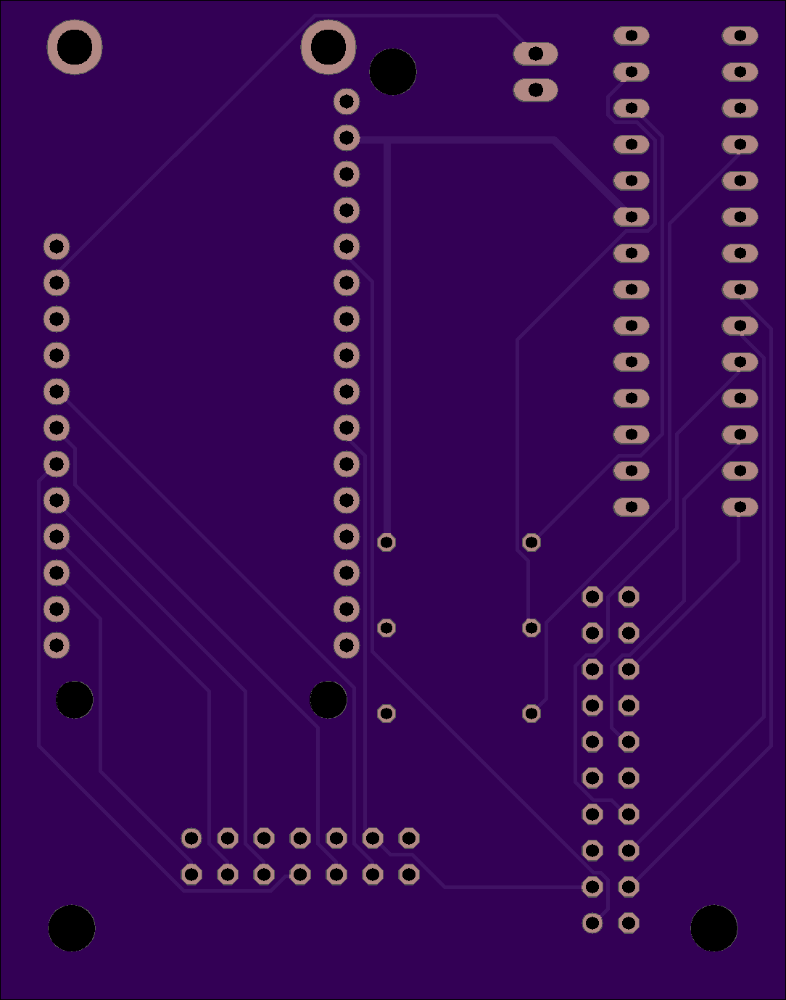

# Natural Ergonomic Keyboard, Type A

One of the best keyboards ever made is the [Microsoft Natural Keyboard](https://en.wikipedia.org/wiki/Microsoft_Natural_Keyboard). 
Unfortunately modern versions of the natural keyboard are significantly worse then the original mid 90s versions. 
The goal of this project is to create a high-quality, open-source replacement for the natural keyboard.


## Goals

* Standard split-QWERTY layout mirroring the Microsoft Natural Keyboards
* No built-in number pad
* High quality mechanical switches
* Bluetooth or USB connection
* Plug and play (no-solder) microcontroller replacement
* Heirloom quality

## Design

The keyboard (and repo) is divided into the following parts:

* Body
* Electronics

### Body


The body has three major components: the aluminum unibody, the left and right steel switch plates and the acrylic access panel. 

Source files:
* `*.kbd.json` files are generated using the [keyboard_layout_editor.com](http://www.keyboard-layout-editor.com)
* `*.svg` and `*.dxf` files are built using [swillkb's Plate and Case Builder](http://builder.swillkb.com/) based on the `.kbd.json` files
  * The `*switch.*` files are the laser cutter templates
* `body.stl` and `body.step` are built from the [CadQuery](https://github.com/dcowden/cadquery) source file `body.py`. The easiest way to build this is to use the provided Docker image and `Makefile`:
  ```bash
    cd body && make
  ```    

You will need to have the following manufactured:
* Case
  * [`body.step`](body/target/body.step)
  * [screw tapping plan](drawings/bottom_view.pdf)
  * CNC from aluminum at [Xometry](http://xometry.com)
* Rubber gaskets
  * [`left_closed.dxf`](body/build_data/left_closed.dxf)
  * [`right_closed.dxf`](body/build_data/right_closed.dxf)
  * Laser cut from Buna-N Rubber 0.031 in at [Big Blue Saw](https://www.bigbluesaw.com/)
* Acrylic plate
  * [`plate.dxf`](drawings/plate.dxf)
  * Laser cut from Acrylic Plastic, Clear 0.118 in at [Big Blue Saw](https://www.bigbluesaw.com/)
* Steel plates
  * [`left_switch.dxf`](body/build_data/left_switch.dxf)
  * [`right_switch.dxf`](body/build_data/right_switch.dxf)
  * Laser cut from 304 Stainless Steel 1.5mm at [Lasergist](https://www.lasergist.com/)
  
You will need to buy:
* 8x M5x8mm screws
* 4x M5x20mm screws
* 3x M3 standoffs
* 3x M3x5mm screws
* 4x [M5 feet](https://www.amazon.com/gp/product/B000PWU9CC)
* 1x [USB-C panel mount](https://www.datapro.net/products/usb-c-panel-mount-extension-cable.html)
* 1x [19mm latching button](https://www.amazon.com/gp/product/B06XQZ3Y76)
* 1x [2-pin JST-XHP connector](https://www.amazon.com/gp/product/B0774TF39N)

### Electronics

The electronics are designed to be swappable. The left and right PCBs only contain the keyboard matrices and the ribbon connectors to the center PCB.

The PCBs can be made directly from the `BRD` files by [OSH Park](http://oshpark.com).

#### Left
[`left.brd`](eagle/nek-type-a/left.brd)

 

#### Right
[`right.brd`](eagle/nek-type-a/right.brd)

 

#### Center
[`center.brd`](eagle/nek-type-a/center.brd)

 

The center PCB uses a [MCP23017E-S/P](https://www.microchip.com/wwwproducts/en/MCP23017) I/O expander hooked to the microprocessor via the I2C bus.
The center is designed to use development boards that conform the [Adafruit](https://www.adafruit.com/feather) interface. 
The Feather is connected via headers on the center PCB so it can be swapped for models with different connectivity in the future was standards evolve.